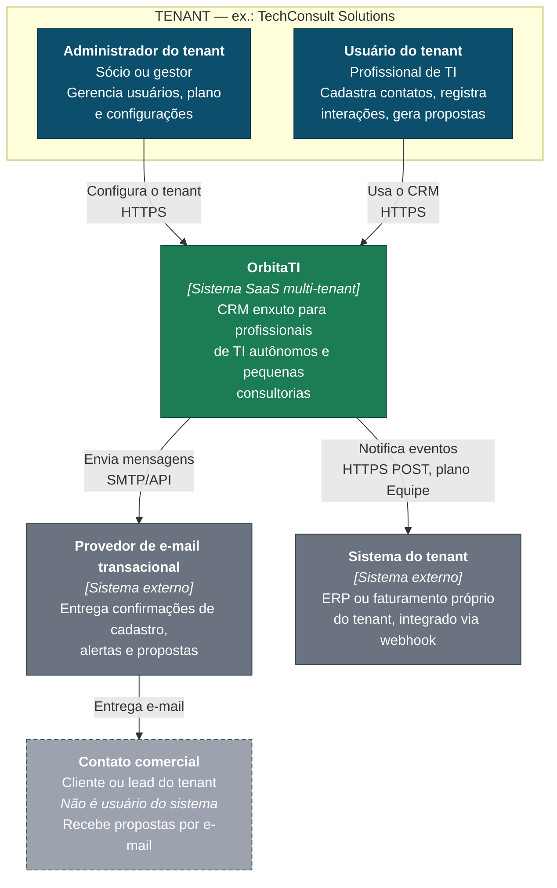
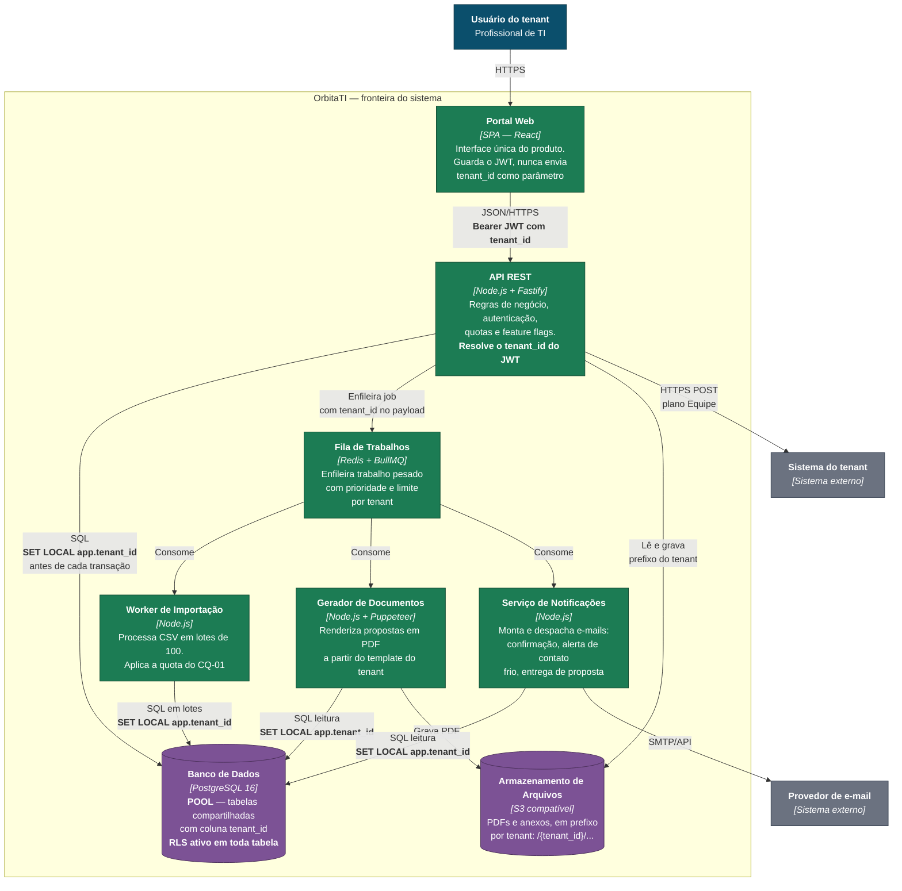
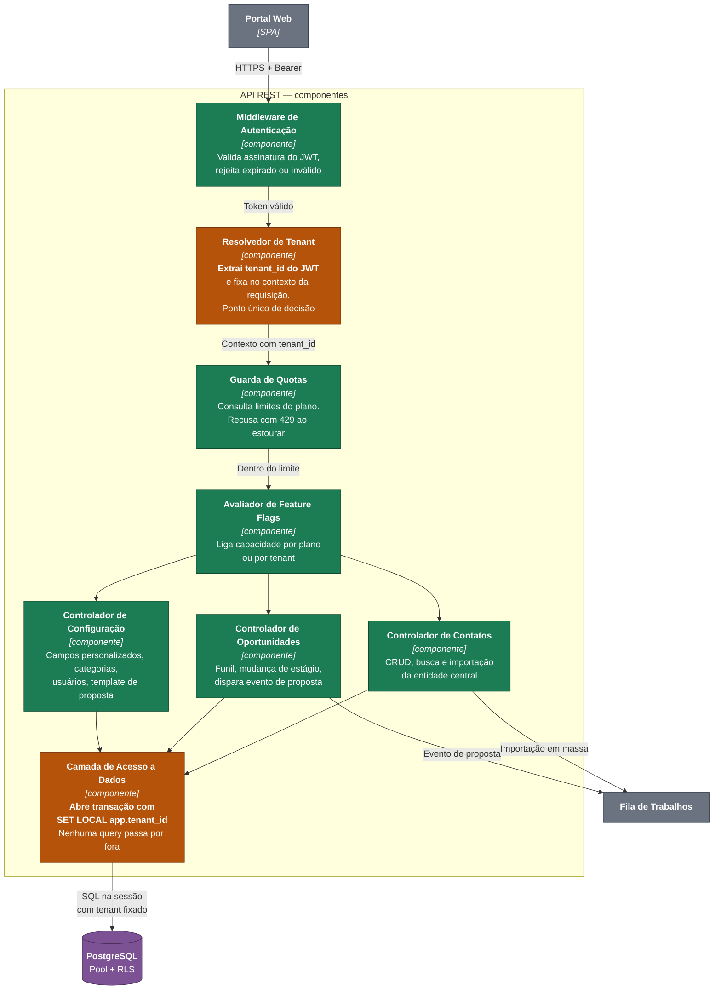

# 1.2 — Arquitetura C4: OrbitaTI

**Unidade:** Andriel Schultz e Cristofer
**Etapa 1 — Proposta de arquitetura**

Este documento apresenta os níveis 1 e 2 completos e um esboço do nível 3. O modelo de tenancy que fundamenta os limites desenhados aqui está em [`adr/adr-001-tenancy.md`](adr/adr-001-tenancy.md).

---

## Onde está o limite de tenant

Antes dos diagramas, a regra que eles materializam.

O OrbitaTI adota **pool**: todos os tenants compartilham as mesmas tabelas, separados pela coluna `tenant_id`. Isso significa que o limite de tenant **não é físico** — não há um banco por cliente, nem um container por cliente. O limite é lógico e é aplicado em três camadas sobrepostas, de fora para dentro:

| Camada | Onde vive | O que faz | O que acontece se falhar |
|---|---|---|---|
| **1. Token** | API REST — middleware de autenticação | Extrai o `tenant_id` do JWT assinado e o injeta no contexto da requisição. O cliente nunca envia `tenant_id` como parâmetro | Requisição rejeitada com 401 antes de tocar em qualquer dado |
| **2. Sessão de banco** | API REST — camada de acesso a dados | Executa `SET LOCAL app.tenant_id` na transação, a partir do contexto | A query roda sem tenant definido e a política de RLS não devolve nenhuma linha |
| **3. Row-Level Security** | PostgreSQL | Política `USING (tenant_id = current_setting('app.tenant_id')::uuid)` em toda tabela com dado de tenant | Nada passa. É a rede de segurança: mesmo um `SELECT * FROM contatos` sem `WHERE` só enxerga o tenant da sessão |

A camada 3 existe porque as camadas 1 e 2 dependem de o desenvolvedor não errar. O RLS é a única que não depende — e por isso é ela, e não a disciplina do time, que sustenta a promessa de isolamento no cenário CQ-02 de [`atributos.md`](atributos.md).

Nos diagramas abaixo, o limite de tenant aparece anotado em cada travessia relevante.

---

## Nível 1 — Contexto

Quem usa o OrbitaTI e com que sistemas ele conversa.

**Leitura do diagrama.** O ator cinza tracejado — o Contato comercial — é o detalhe que define o produto: ele é o titular do dado mais importante do sistema e **não tem conta**. Nunca aceitou termo de uso, não faz login, muitas vezes não sabe que está cadastrado. É essa assimetria que coloca o OrbitaTI como operador e o tenant como controlador no mapeamento de [`lgpd.md`](lgpd.md).

O webhook para o sistema do tenant é o degrau 3 da escada de customização: o tenant integra o que quiser sem que o OrbitaTI ganhe código específico para ele.

---

## Nível 2 — Containers

O que roda dentro do OrbitaTI.

### Containers em detalhe

| Container | Tecnologia | Responsabilidade | Como respeita o limite de tenant |
|---|---|---|---|
| **Portal Web** | React, SPA | Única interface do produto; responsiva, pensada para uso em celular | Guarda o JWT; **nunca** envia `tenant_id` como parâmetro — se enviasse, bastaria trocar o valor para ler outro tenant |
| **API REST** | Node.js + Fastify | Regras de negócio, autenticação, autorização, quotas e avaliação de feature flags | Middleware extrai o `tenant_id` do JWT assinado e o fixa no contexto; a camada de dados abre toda transação com `SET LOCAL app.tenant_id` |
| **Fila de Trabalhos** | Redis + BullMQ | Tira trabalho pesado do caminho da requisição; aplica prioridade e limite de jobs simultâneos por tenant | O `tenant_id` viaja no payload do job e é reaplicado pelo worker antes de qualquer query |
| **Worker de Importação** | Node.js | Processa CSV em lotes de 100 linhas com pausa entre lotes | Executa a quota do cenário CQ-01: é o container que impede o vizinho barulhento |
| **Gerador de Documentos** | Node.js + Puppeteer | Renderiza proposta em PDF a partir do template configurado pelo tenant | Lê o template do próprio tenant; grava no prefixo `/{tenant_id}/` do armazenamento |
| **Serviço de Notificações** | Node.js | Monta e despacha e-mails transacionais | Só enxerga destinatários do tenant do job |
| **Banco de Dados** | PostgreSQL 16 | Guarda contatos, oportunidades, interações, usuários e configuração | **Pool com RLS** — a política de linha é a última barreira e não depende do código da aplicação |
| **Armazenamento** | S3 compatível | PDFs gerados e anexos | Chaves prefixadas por `tenant_id`; política de acesso nega leitura fora do prefixo |

### Por que fila e worker já na Etapa 1

A fila não é sofisticação prematura — ela é a resposta arquitetural ao vizinho barulhento. Com pool, a importação de 500 contatos da TechConsult roda no mesmo banco que atende a busca do Marcelo. Se essa importação acontecesse dentro da requisição HTTP, ela seguraria uma conexão e um lote grande de escritas pelo tempo que levasse, degradando todo mundo.

Tirando o trabalho pesado do caminho da requisição e fatiando em lotes de 100 com pausa, o pico de um tenant vira uma sequência de rajadas curtas em vez de um bloqueio longo. É essa decisão que torna o cenário CQ-01 cumprível — e é por isso que ela está em [`adr/adr-003-processamento-assincrono.md`](adr/adr-003-processamento-assincrono.md), não enterrada no código.

---

## Nível 3 — Esboço: dentro da API REST

Detalhamento do container onde mora a decisão de tenancy. Os demais containers ficam para a Etapa 2.

Os dois componentes em laranja são os que sustentam o isolamento. O **Resolvedor de Tenant** é o ponto único onde se decide de quem é a requisição; o **Camada de Acesso a Dados** é o ponto único por onde o banco é tocado. Concentrar essas duas responsabilidades em um lugar cada é o que torna o isolamento testável — a suíte do cenário CQ-02 mira exatamente esses dois pontos.

---

## Decisões registradas

| Decisão | ADR |
|---|---|
| Pool com RLS em vez de silo ou schema-per-tenant | [`adr/adr-001-tenancy.md`](adr/adr-001-tenancy.md) |
| `tenant_id` dentro do JWT, nunca em parâmetro | [`adr/adr-002-identidade-tenant.md`](adr/adr-002-identidade-tenant.md) |
| Trabalho pesado em fila com lote e quota | [`adr/adr-003-processamento-assincrono.md`](adr/adr-003-processamento-assincrono.md) |

---

*Documento versionado em `docs/02-arquitetura-c4.md`. Diagramas em Mermaid, renderizados nativamente pelo GitHub.*
